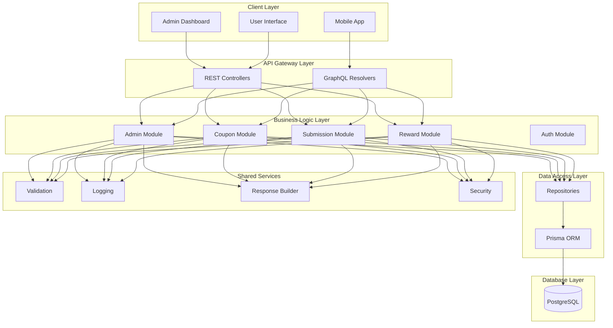

# Design Document

## Overview

The Lottery Coupon Management System is designed as a comprehensive backend solution using NestJS with dual API support (REST and GraphQL). The system replaces the existing product management functionality and provides secure coupon generation, user data collection, and administrative management capabilities. The architecture maintains the existing layered approach with modules, services, repositories, and separate API layers.

## Architecture

### High-Level Architecture



### Module Structure

The system follows the existing NestJS modular architecture:

```
src/
├── modules/                    # Business logic modules
│   ├── admin/                 # Admin management
│   ├── auth/                  # Authentication
│   ├── coupon/                # Coupon generation & management
│   ├── submission/            # User data collection
│   └── reward/                # Reward management
├── api/rest/                  # REST API controllers
│   ├── admin/
│   ├── auth/
│   ├── coupon/
│   ├── submission/
│   └── reward/
├── graphql/                   # GraphQL resolvers
│   ├── admin/
│   ├── auth/
│   ├── coupon/
│   ├── submission/
│   └── reward/
├── shared/                    # Shared utilities
├── core/                      # Core configurations
└── database/                  # Database configurations
```

## Components and Interfaces

### 1. Authentication Module

**Purpose**: Handle admin authentication and session management

**Components**:
- `AuthService`: JWT token generation, validation, password hashing
- `AuthController`: REST endpoints for login/logout
- `AuthResolver`: GraphQL mutations for authentication
- `JwtStrategy`: Passport JWT strategy implementation
- `AuthGuard`: Route protection middleware

**Key Interfaces**:
```typescript
interface LoginDto {
  username: string;
  password: string;
}

interface AuthResponse {
  accessToken: string;
  refreshToken: string;
  admin: AdminProfile;
  expiresIn: number;
}

interface AdminProfile {
  id: number;
  username: string;
  email: string;
  role: AdminRole;
  lastLogin: Date;
}
```

### 2. Admin Module

**Purpose**: Manage administrator accounts and permissions

**Components**:
- `AdminService`: CRUD operations for admin accounts
- `AdminController`: REST endpoints for admin management
- `AdminResolver`: GraphQL operations for admin data
- `AdminRepository`: Database operations for admin entity

**Key Interfaces**:
```typescript
interface CreateAdminDto {
  username: string;
  email: string;
  password: string;
  role: AdminRole;
}

interface AdminEntity {
  id: number;
  username: string;
  email: string;
  passwordHash: string;
  role: AdminRole;
  isActive: boolean;
  createdAt: Date;
  updatedAt: Date;
  lastLogin?: Date;
}
```

### 3. Coupon Module

**Purpose**: Generate, manage, and track coupon codes

**Components**:
- `CouponService`: Business logic for coupon operations
- `CouponController`: REST endpoints for coupon management
- `CouponResolver`: GraphQL operations for coupon data
- `CouponRepository`: Database operations for coupon entity
- `CouponGeneratorService`: Unique code generation logic
- `BatchService`: Batch management functionality

**Key Interfaces**:
```typescript
interface GenerateCouponDto {
  quantity: number;
  codeLength?: number;
  expirationDays?: number;
  batchName?: string;
}

interface CouponEntity {
  id: number;
  couponCode: string;
  batchId?: string;
  codeLength: number;
  status: CouponStatus;
  createdBy: number;
  createdAt: Date;
  expiresAt?: Date;
  redeemedAt?: Date;
  redeemedBy?: number;
}

interface CouponValidationResult {
  isValid: boolean;
  coupon?: CouponEntity;
  error?: string;
}
```

### 4. Submission Module

**Purpose**: Handle user data collection, coupon redemption, and admin reward assignment

**Components**:
- `SubmissionService`: Process user form submissions and reward assignments
- `SubmissionController`: REST endpoints for user interactions and admin management
- `SubmissionResolver`: GraphQL operations for submission data and reward assignments
- `SubmissionRepository`: Database operations for submission entity
- `ValidationService`: User input validation
- `RewardAssignmentService`: Handle admin reward distribution to users

**Key Interfaces**:
```typescript
interface CreateSubmissionDto {
  couponCode: string;
  name: string;
  email: string;
  phone: string;
  address: string;
  productExperience: string;
}

interface SubmissionEntity {
  id: number;
  couponId: number;
  name: string;
  email: string;
  phone: string;
  address: string;
  productExperience: string;
  submittedAt: Date;
  ipAddress?: string;
  userAgent?: string;
  assignedRewardId?: number;
  rewardAssignedAt?: Date;
  rewardAssignedBy?: number;
}
```

### 5. Reward Module

**Purpose**: Manage reward accounts and distribution to users

**Components**:
- `RewardService`: CRUD operations for reward accounts and distribution
- `RewardController`: REST endpoints for reward account management
- `RewardResolver`: GraphQL operations for reward data
- `RewardRepository`: Database operations for reward entity
- `RewardDistributionService`: Handle reward assignment to users

**Key Interfaces**:
```typescript
interface CreateRewardAccountDto {
  serviceName: string;
  accountType: string;
  credentials: string; // encrypted
  subscriptionDuration?: string;
  description?: string;
  category: RewardCategory;
}

interface RewardAccountEntity {
  id: number;
  serviceName: string;
  accountType: string;
  encryptedCredentials: string;
  subscriptionDuration?: string;
  description?: string;
  category: RewardCategory;
  status: RewardStatus;
  assignedToUserId?: number;
  assignedAt?: Date;
  createdAt: Date;
  updatedAt: Date;
}

interface AssignRewardDto {
  rewardAccountId: number;
  userId: number;
  notes?: string;
}
```

## Data Models

### Database Schema Design

The system uses PostgreSQL with Prisma ORM. The schema includes the following entities:

```prisma
model Admin {
  id           Int      @id @default(autoincrement())
  username     String   @unique
  email        String   @unique
  passwordHash String
  role         AdminRole @default(ADMIN)
  isActive     Boolean  @default(true)
  createdAt    DateTime @default(now())
  updatedAt    DateTime @updatedAt
  lastLogin    DateTime?
  
  // Relations
  createdCoupons Coupon[] @relation("CreatedBy")
  createdRewards RewardAccount[] @relation("RewardCreatedBy")
  assignedRewards Submission[] @relation("RewardAssignedBy")
  
  @@index([username])
  @@index([email])
  @@map("admins")
}

model Coupon {
  id               Int           @id @default(autoincrement())
  couponCode       String        @unique
  batchId          String?
  codeLength       Int           @default(10)
  status           CouponStatus  @default(ACTIVE)
  createdBy        Int
  createdAt        DateTime      @default(now())
  expiresAt        DateTime?
  redeemedAt       DateTime?
  redeemedBy       Int?
  generationMethod GenerationMethod @default(SINGLE)
  metadata         Json?
  
  // Relations
  creator     Admin @relation("CreatedBy", fields: [createdBy], references: [id])
  submission  Submission? @relation("RedeemedCoupon")
  
  @@index([couponCode])
  @@index([status])
  @@index([batchId])
  @@index([createdBy])
  @@index([expiresAt])
  @@map("coupons")
}

model Submission {
  id                  Int      @id @default(autoincrement())
  couponId            Int      @unique
  name                String
  email               String
  phone               String
  address             String
  productExperience   String
  submittedAt         DateTime @default(now())
  ipAddress           String?
  userAgent           String?
  additionalData      Json?
  assignedRewardId    Int?
  rewardAssignedAt    DateTime?
  rewardAssignedBy    Int?
  
  // Relations
  coupon        Coupon @relation("RedeemedCoupon", fields: [couponId], references: [id])
  assignedReward RewardAccount? @relation("AssignedReward", fields: [assignedRewardId], references: [id])
  rewardAssignedByAdmin Admin? @relation("RewardAssignedBy", fields: [rewardAssignedBy], references: [id])
  
  @@index([couponId])
  @@index([email])
  @@index([assignedRewardId])
  @@index([submittedAt])
  @@map("user_submissions")
}

model RewardAccount {
  id                    Int      @id @default(autoincrement())
  serviceName           String
  accountType           String
  encryptedCredentials  String
  subscriptionDuration  String?
  description           String?
  category              RewardCategory
  status                RewardStatus @default(AVAILABLE)
  assignedToUserId      Int?
  assignedAt            DateTime?
  createdAt             DateTime @default(now())
  updatedAt             DateTime @updatedAt
  createdBy             Int
  
  // Relations
  creator       Admin @relation("RewardCreatedBy", fields: [createdBy], references: [id])
  assignedSubmission Submission? @relation("AssignedReward")
  
  @@index([status])
  @@index([category])
  @@index([assignedToUserId])
  @@map("reward_accounts")
}

model SystemConfig {
  id          Int      @id @default(autoincrement())
  configKey   String   @unique
  configValue String
  configType  ConfigType @default(STRING)
  description String?
  createdAt   DateTime @default(now())
  updatedAt   DateTime @updatedAt
  
  @@index([configKey])
  @@map("system_configs")
}

enum AdminRole {
  SUPER_ADMIN
  ADMIN
}

enum CouponStatus {
  ACTIVE
  REDEEMED
  EXPIRED
  DEACTIVATED
}

enum GenerationMethod {
  SINGLE
  BATCH
}

enum ConfigType {
  STRING
  NUMBER
  BOOLEAN
  JSON
}

enum RewardCategory {
  STREAMING_SERVICE
  GIFT_CARD
  SUBSCRIPTION
  DIGITAL_PRODUCT
  OTHER
}

enum RewardStatus {
  AVAILABLE
  ASSIGNED
  EXPIRED
  DEACTIVATED
}
```

### DTO Inheritance Strategy

Following the existing pattern, DTOs are organized in layers:

**Base DTOs** (in modules):
```typescript
// src/modules/coupon/dto/coupon-base.dto.ts
@InputType('CouponBaseInput')
@ObjectType()
export class CouponBaseDto {
  @Field(() => Int, { nullable: true })
  @ApiPropertyOptional()
  id?: number;

  @Field()
  @ApiProperty()
  @IsNotEmpty()
  couponCode: string;

  @Field(() => CouponStatus)
  @ApiProperty({ enum: CouponStatus })
  status: CouponStatus;
  
  // ... other fields
}
```

**REST DTOs** (in api/rest):
```typescript
// src/api/rest/coupon/dto/generate-coupon.dto.ts
export class GenerateCouponDto extends OmitType(CouponBaseDto, ['id', 'couponCode', 'status']) {
  @ApiProperty()
  @IsInt()
  @Min(1)
  @Max(1000)
  quantity: number;

  @ApiPropertyOptional()
  @IsOptional()
  @IsInt()
  @Min(8)
  @Max(12)
  codeLength?: number;
}
```

**GraphQL DTOs** (in graphql):
```typescript
// src/graphql/coupon/dto/generate-coupon-input.dto.ts
@InputType()
export class GenerateCouponInput extends OmitType(CouponBaseDto, ['id', 'couponCode', 'status']) {
  @Field(() => Int)
  quantity: number;

  @Field(() => Int, { nullable: true })
  codeLength?: number;
}
```

## Error Handling

### Error Types and Responses

The system implements comprehensive error handling:

```typescript
// Custom Exception Classes
export class CouponValidationException extends BadRequestException {
  constructor(message: string, code?: string) {
    super({
      error: 'COUPON_VALIDATION_ERROR',
      message,
      code,
      timestamp: new Date().toISOString()
    });
  }
}

export class CouponExpiredException extends BadRequestException {
  constructor(couponCode: string) {
    super({
      error: 'COUPON_EXPIRED',
      message: `Coupon ${couponCode} has expired`,
      timestamp: new Date().toISOString()
    });
  }
}

export class CouponAlreadyRedeemedException extends BadRequestException {
  constructor(couponCode: string) {
    super({
      error: 'COUPON_ALREADY_REDEEMED',
      message: `Coupon ${couponCode} has already been redeemed`,
      timestamp: new Date().toISOString()
    });
  }
}
```

### Global Error Filter

```typescript
@Catch()
export class GlobalExceptionFilter implements ExceptionFilter {
  catch(exception: unknown, host: ArgumentsHost) {
    const ctx = host.switchToHttp();
    const response = ctx.getResponse();
    const request = ctx.getRequest();

    let status = HttpStatus.INTERNAL_SERVER_ERROR;
    let message = 'Internal server error';
    let error = 'INTERNAL_ERROR';

    if (exception instanceof HttpException) {
      status = exception.getStatus();
      const exceptionResponse = exception.getResponse();
      
      if (typeof exceptionResponse === 'object') {
        message = exceptionResponse['message'] || message;
        error = exceptionResponse['error'] || error;
      }
    }

    const errorResponse = {
      success: false,
      statusCode: status,
      error: {
        code: error,
        message,
        timestamp: new Date().toISOString(),
        path: request.url,
        traceId: request.traceId
      }
    };

    response.status(status).json(errorResponse);
  }
}
```

## Testing Strategy

### Unit Testing

Each module includes comprehensive unit tests:

```typescript
// Example: CouponService unit tests
describe('CouponService', () => {
  let service: CouponService;
  let repository: CouponRepository;
  let generatorService: CouponGeneratorService;

  beforeEach(async () => {
    const module = await Test.createTestingModule({
      providers: [
        CouponService,
        {
          provide: CouponRepository,
          useValue: mockCouponRepository,
        },
        {
          provide: CouponGeneratorService,
          useValue: mockGeneratorService,
        },
      ],
    }).compile();

    service = module.get<CouponService>(CouponService);
    repository = module.get<CouponRepository>(CouponRepository);
    generatorService = module.get<CouponGeneratorService>(CouponGeneratorService);
  });

  describe('generateCoupons', () => {
    it('should generate unique coupon codes', async () => {
      // Test implementation
    });

    it('should handle duplicate code generation', async () => {
      // Test implementation
    });

    it('should create batch tracking for multiple codes', async () => {
      // Test implementation
    });
  });
});
```

### Integration Testing

API endpoint testing for both REST and GraphQL:

```typescript
// Example: REST API integration tests
describe('CouponController (e2e)', () => {
  let app: INestApplication;
  let authToken: string;

  beforeAll(async () => {
    const moduleFixture = await Test.createTestingModule({
      imports: [AppModule],
    }).compile();

    app = moduleFixture.createNestApplication();
    await app.init();

    // Get auth token for admin operations
    authToken = await getAuthToken(app);
  });

  describe('/api/admin/coupons/generate (POST)', () => {
    it('should generate coupon codes successfully', () => {
      return request(app.getHttpServer())
        .post('/api/admin/coupons/generate')
        .set('Authorization', `Bearer ${authToken}`)
        .send({
          quantity: 5,
          codeLength: 10,
          expirationDays: 30
        })
        .expect(201)
        .expect((res) => {
          expect(res.body.data).toHaveLength(5);
          expect(res.body.data[0].couponCode).toMatch(/^[A-Z2-9]{10}$/);
        });
    });
  });
});
```

### Database Testing

Prisma integration tests with test database:

```typescript
describe('CouponRepository', () => {
  let repository: CouponRepository;
  let prisma: PrismaService;

  beforeAll(async () => {
    // Setup test database
    prisma = new PrismaService();
    repository = new CouponRepository(prisma);
    
    // Clean database before tests
    await prisma.coupon.deleteMany();
  });

  afterAll(async () => {
    await prisma.$disconnect();
  });

  it('should create coupon with unique code', async () => {
    const couponData = {
      couponCode: 'TEST123456',
      codeLength: 10,
      createdBy: 1
    };

    const result = await repository.create(couponData);
    
    expect(result.couponCode).toBe('TEST123456');
    expect(result.status).toBe(CouponStatus.ACTIVE);
  });
});
```

## Security Considerations

### Authentication & Authorization

1. **JWT Token Management**:
   - Access tokens with short expiration (15 minutes)
   - Refresh tokens with longer expiration (7 days)
   - Token blacklisting for logout

2. **Password Security**:
   - bcrypt hashing with salt rounds of 12
   - Password complexity requirements
   - Secure password reset flow

3. **Role-Based Access Control**:
   - Admin and Super Admin roles
   - Route-level permission guards
   - Resource-level access control

### Input Validation & Sanitization

1. **Request Validation**:
   - class-validator decorators on all DTOs
   - Custom validation pipes for complex rules
   - SQL injection prevention through Prisma

2. **Data Sanitization**:
   - HTML entity encoding for user inputs
   - XSS prevention through content security policies
   - Input length limits and format validation

### Rate Limiting & Security Headers

1. **Rate Limiting**:
   - API rate limiting per IP address
   - Stricter limits for sensitive operations
   - Exponential backoff for failed attempts

2. **Security Headers**:
   - CORS configuration for allowed origins
   - Security headers middleware
   - HTTPS enforcement in production

## Performance Optimization

### Database Optimization

1. **Indexing Strategy**:
   - Primary indexes on frequently queried columns
   - Composite indexes for complex queries
   - Partial indexes for filtered queries

2. **Query Optimization**:
   - Prisma query optimization
   - Connection pooling configuration
   - Query result caching for static data

### Caching Strategy

1. **Redis Caching**:
   - Cache frequently accessed data
   - Session storage in Redis
   - Cache invalidation strategies

2. **Application-Level Caching**:
   - In-memory caching for configuration data
   - Response caching for read-heavy endpoints
   - Cache warming strategies

### Monitoring & Logging

1. **Application Monitoring**:
   - Performance metrics collection
   - Error tracking and alerting
   - Database query performance monitoring

2. **Logging Strategy**:
   - Structured logging with Winston
   - Log levels and filtering
   - Audit trail for admin actions

This design provides a comprehensive foundation for implementing the lottery coupon management system while maintaining the existing architectural patterns and ensuring scalability, security, and maintainability.